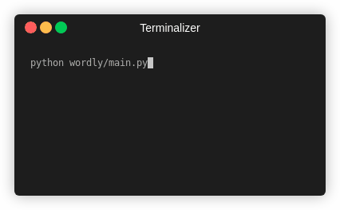
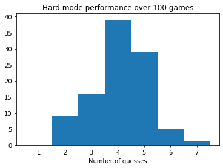

# Cyborg Wordle

Command-line Wordle game with optional assistance from your AI pal, Wordly.

Supports normal mode and hard mode.

Type '?' to get a hint from Wordly if you're stuck. Man and machine combine to conquer Wordle.

## Usage 

To play: `python main.py`.

Hard mode: `python main.py --hard` 

Watch Wordly play: `python main.py --ai`. AI mode uses a harder word list.

## Design Details

### Game

Just as in Wordle, you have six guesses to find a target five-letter word.

In hard mode, information from previous guesses must be used.

Solutions will always be in the top 4000 most common English words. However, any 5-letter word
may be used as a guess.

### AI Details

Wordly does not exhaustively search every possible guess and solution.
Instead, Wordly considers a few hundred words and picks one that will narrow down the pool of possible answers.
This produces good-enough guesses quickly. Wordly will win ~99% of all Wordle games.

 
### Further reading

Wordly's heuristics are based on these sources.

https://www.poirrier.ca/notes/wordle

http://sonorouschocolate.com/notes/index.php?title=The_best_strategies_for_Wordle
